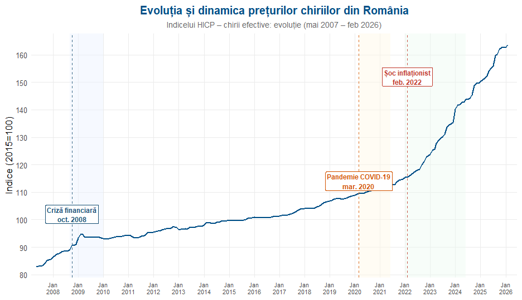
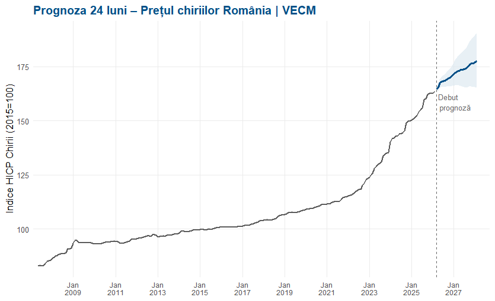
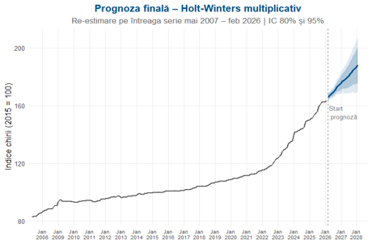

# Forecasting Romanian Rental Prices

The Romanian rental market changed visibly after 2022. This project analyzes the structural shift in rental prices and estimates their likely evolution over the next two years using statistical forecasting models.

---

## A market that changed after 2022

For more than a decade, rental prices increased gradually. After the inflation shock of 2022, the pace of growth accelerated substantially.

### What the chart reveals

* post-2008 stabilization,
* a temporary slowdown during the COVID-19 period,
* a sharp acceleration after February 2022,
* a new growth regime that differs from the previous decade.

---

## Forecasting the next 24 months

### Multivariate forecast (VECM)

The VECM specification indicates that rental prices are likely to continue increasing over the forecast horizon, while preserving the long-run relationship between the analyzed variables.

---

### Final forecast (Holt–Winters multiplicative)

The final model projects continued growth through 2028, with widening uncertainty bands as the forecast horizon extends.

---

## Key findings

* The strongest rental price acceleration occurs **after 2022**.
* The recent trajectory is inconsistent with a return to the pre-2022 trend.
* Short-term forecasts point to **continued upward pressure on rents**.
* Recent increases appear to reflect a persistent market shift rather than a temporary fluctuation.

---

## Why this matters

The results are relevant for:

* **real estate investors** evaluating rental income expectations,
* **financial institutions** assessing housing-market exposure,
* **public authorities** monitoring housing affordability,
* **households and businesses** planning future housing costs.

---

## Analytical approach

* Exploratory time-series analysis
* Interpretation of major economic events
* **VECM** multivariate forecasting
* **Holt–Winters multiplicative** forecasting
* Forecast comparison and model evaluation in **R**

---

## Tools

**R · Time-Series Analysis · VECM · Holt–Winters · Forecasting · Statistical Modeling · Data Visualization**

---

## Repository structure

* `scripts/` – analysis and forecasting code
* `images/` – figures used in the project
* `report/` – full project report

---

## Takeaway

The Romanian rental market appears to have entered a higher-growth phase after 2022. The forecasting evidence suggests that rental prices are likely to remain on an upward trajectory in the near term, with important implications for housing affordability and investment planning.
